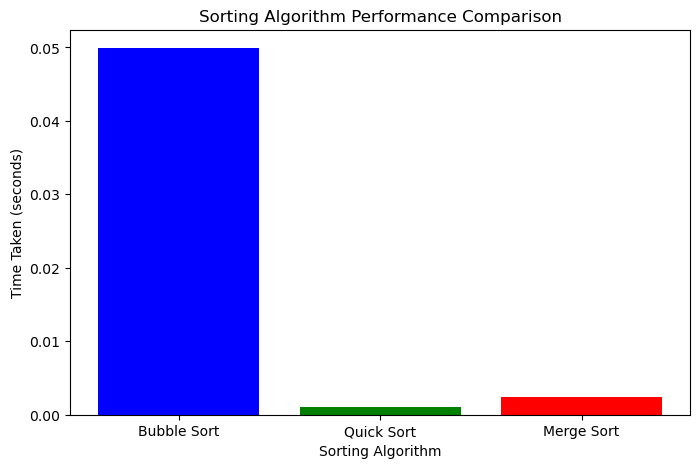

# Sorting Algorithm Performance Analysis 📊

### 🔍 Overview  
This project compares the performance of different sorting algorithms using a dataset of randomly generated stock prices.

### 🏆 Algorithms Implemented:
✔️ **Bubble Sort**  
✔️ **Quick Sort**  
✔️ **Merge Sort**

### ⏳ Performance Comparison
- Quick Sort is the fastest with an average time complexity of **O(n log n)**.
- Merge Sort also performs well with **O(n log n)**.
- Bubble Sort is slow with **O(n²)** complexity.

### 📈 Results
Below is the performance graph of different algorithms:

### 💻 How to Run This Project
1. Install dependencies:  
